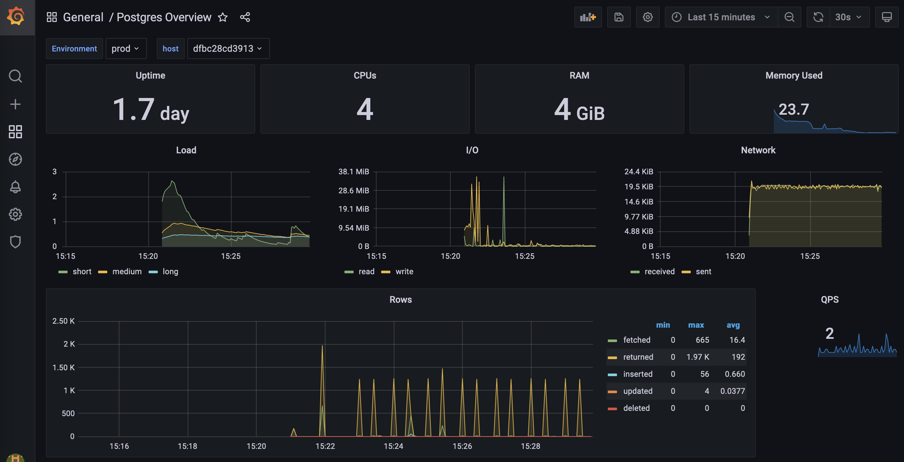
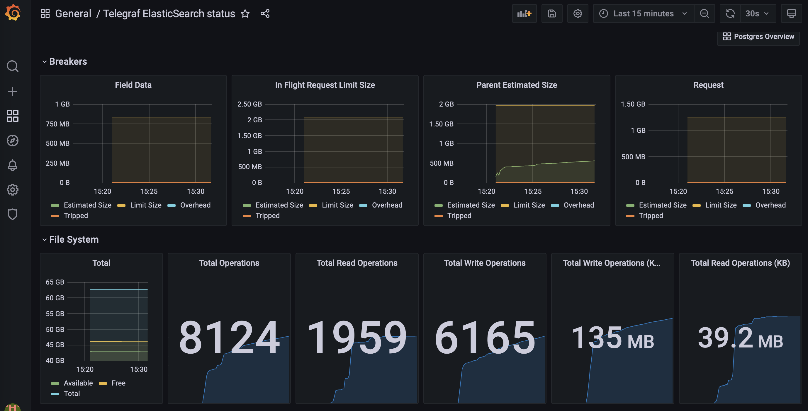

# Monitoring
## TIG stack:

Implement simple app with Postgres and ElasticSearch interaction.  
Configure monitoring of Postgres and ElasticSearch databases via TIG (Telegraf - InfluxDB - Grafana) stack.  

### Run
- build and up app: `docker-compose up --build`  
- call app a few times to store requests in booth DBs `curl http://127.0.0.1:8000/?var1=value1&var2=value2&var3=value3`
- open [Grafana](http://0.0.0.0:3000) (admin/admin) and found monitoring on dashboards

Used Dashboards:  
- [pg](https://grafana.com/grafana/dashboards/355)
- [es](https://grafana.com/grafana/dashboards/3373)